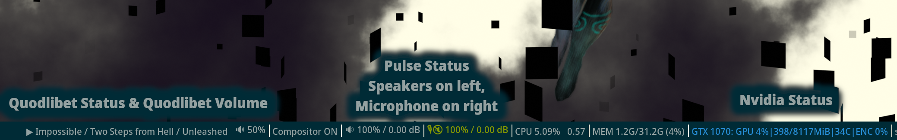

# i3blocks-widgets-rs
Various widgets made for i3blocks.
All of them support CLI arguments, so flags and basic functionality can be displayed using the `--help` command.
General design includes a shorthand format for when i3blocks gets too long, lots of flags for different display settings, and the ability to change devices for hardware monitors.

Note that these are my projects for learning Rust, so don't expect me to be Hackerman™.

## nvidia-status
Shows lots of information for Nvidia GPUs.
- Changes color based on GPU status.
- Many flags for which stats to show.

## pulse-status
Creates an interactive widget for a given pulse device.
- Defaults to standard sink, or standard source when `--source` is passed
- Pretty colors
- Buttons
    - LMB -> Toggle mute
    - RMB -> Reset volume to 100%
    - Scrollwheel -> Adjust volume

## quodlibet-status
Creates an interactive widget for the Quod Libet music player
- Shows title, artist, album.
- Optionally displays 'discsubtitle'. I find this useful as a custom field to do with what I wish. Example is I have a mixed album of bgm from the Yakuza games, and I use the 'discsubtitle' field to label which game it's from.
- Buttons
    - LMB -> Play/Pause
    - RMB -> Stop
    - MMB -> Show/hide Quod Libet window
    - Scrollwheel -> Switch tracks

### quodlibet-volume
To be used with quodlibet-status. Separate binary since they should be two separate buttons, and having a plain --volume flag would be weird.
- Buttons
    - LMB/RMB -> Volume up/down
    - Scrollwheel -> Volume up/down

## i3blocks usage
All of these use standard CLI flags and options instead of environment variables like i3blocks does by default. This is easier to manage IMO, and to make it work inside i3blocks is rather easy config-wise.

Example using pulse-status to display the default input source:
```
[pulse-source]
interval=10
signal=1
command=./pulse-status --source $button
```
The first 3 lines are regular i3blocks stuff. See their wiki.

The `command=` line is where the programs do their work. You specify the command as you would in regular shell, with the mouse button sent from i3blocks being in the $button var. This means I can simply use the CLAP crate to add loads of configuration for icons, colors, device ID, etc. Again, run ./[binary] --help to see the options available.

## Building
Run ./build.sh to build all of them. Binaries will be in `./bin`. 

You can also manually build individual binaries by running
```
Cargo build --release --bin [binary, ex: pulse-status]
```
File will then be at ./target/release/[binary]
